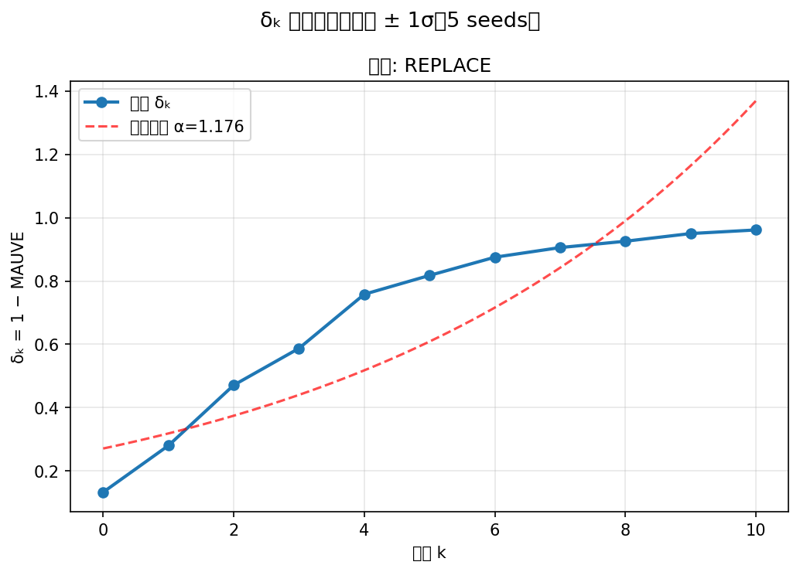
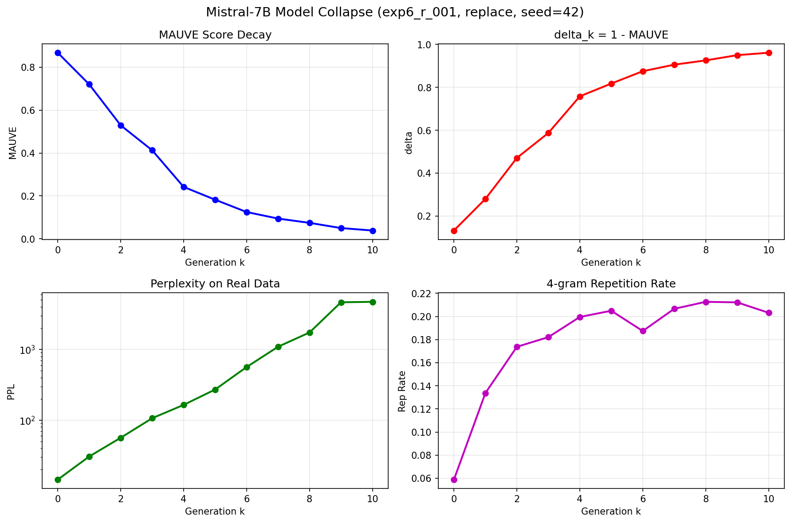
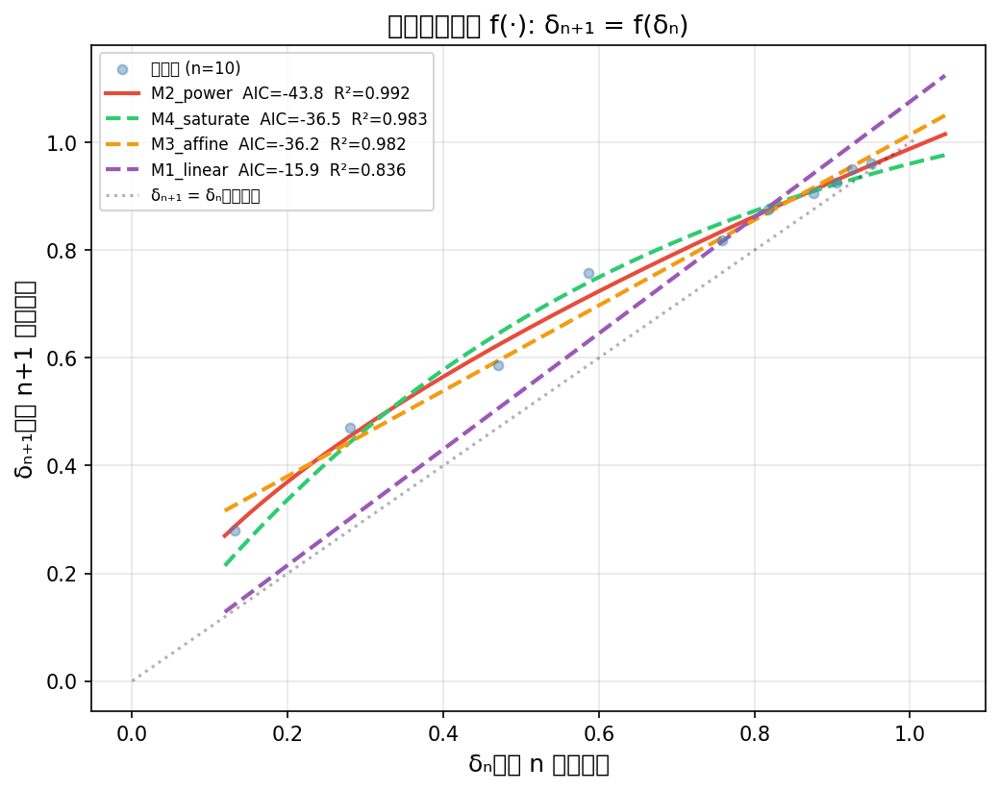

# IQD：信息质量密度框架 — 量化多代 AI 模型崩溃

本研究项目探索多代 AI 模型崩溃现象，提出 **IQD（Information Quality Density）** 框架作为统一的量化指标。基于 "Strong Model Collapse"（Dohmatob et al., ICLR 2025）等工作，我们从第一性原理推导偏差 δ 的来源，并首次使用 MAUVE 分数实证追踪多代崩溃过程。

---

## 实验结果：Mistral-7B 多代崩溃链（exp6_r_001）

### 实验设置

| 参数 | 值 |
|------|-----|
| 基础模型 | mistralai/Mistral-7B-v0.1 |
| 训练数据 | OpenWebText（每代 5000 样本）|
| 混合策略 | Replace（每代仅用上一代合成数据训练）|
| 代数 | 0–10（共 11 代）|
| 随机种子 | 42 |
| GPU | NVIDIA A100-SXM4-80GB |

### 核心指标

| 代数 | MAUVE ↑ | δₖ = 1−MAUVE ↑ | PPL（真实数据）↑ | 4-gram 重复率 |
|------|---------|----------------|-----------------|---------------|
| Gen 0 | 0.8677 | 0.1323 | 14.4 | 5.9% |
| Gen 1 | 0.7202 | 0.2798 | 30.7 | 13.4% |
| Gen 2 | 0.5292 | 0.4708 | 56.4 | 17.4% |
| Gen 3 | 0.4128 | 0.5872 | 106.6 | 18.2% |
| Gen 4 | 0.2420 | 0.7580 | 164.5 | 20.0% |
| Gen 5 | 0.1824 | 0.8176 | 271.0 | 20.5% |
| Gen 6 | 0.1248 | 0.8752 | 563.2 | 18.7% |
| Gen 7 | 0.0943 | 0.9057 | 1091.8 | 20.7% |
| Gen 8 | 0.0743 | 0.9257 | 1736.5 | 21.3% |
| Gen 9 | 0.0500 | 0.9500 | 4643.5 | 21.2% |
| Gen 10 | 0.0386 | 0.9614 | 4711.3 | 20.3% |

### 分析图表

#### δₖ 衰减曲线（含指数拟合）


#### 多指标演化（MAUVE / δ / PPL / 重复率）


#### 偏差传递函数拟合 δₙ₊₁ = f(δₙ)


### 关键发现

1. **MAUVE 指数衰减**：从 0.868 衰减至 0.039，10 代后模型输出与真实分布几乎完全脱节

2. **PPL 爆炸**：困惑度从 14.4 飙升至 4711.3，**增长 327 倍**，模型对真实文本的建模能力彻底崩溃

3. **传递函数为幂律**：拟合四种候选模型（线性 / 幂律 / 仿射 / 饱和），**幂律模型 M2 最优**：
   ```
   δₙ₊₁ = 0.989 · δₙ^0.610    (R² = 0.992)
   ```
   AIC/BIC 模型选择结果：
   | 模型 | AIC | BIC | R² |
   |------|-----|-----|-----|
   | M1 线性 | -15.95 | -15.34 | 0.836 |
   | **M2 幂律** | **-43.80** | **-42.89** | **0.992** |
   | M3 仿射 | -36.24 | -35.33 | 0.982 |
   | M4 饱和 | -36.52 | -35.62 | 0.983 |

4. **重复率饱和于 ~20%**：崩溃不仅仅是文本重复，更根本的是**分布偏移**——模型生成的文本在语义空间中收缩到一个越来越小的子空间

5. **崩溃的两个阶段**：
   - **快速崩溃期**（Gen 0–4）：δ 从 0.13 快速增长至 0.76，PPL 翻 11 倍
   - **饱和期**（Gen 5–10）：δ 增长放缓趋近 1.0，但 PPL 继续指数增长

### 模型权重

所有代的模型权重已上传至 HuggingFace：[ludandaye/mistral-7b-collapse-exp6](https://huggingface.co/ludandaye/mistral-7b-collapse-exp6)

---

## 项目结构

```
.
├── docs/                   # 研究笔记与理论框架
├── references/             # 参考论文
├── src/                    # 实验源码
│   ├── train/              # 训练流水线（单代训练 + 链式训练）
│   ├── eval/               # 评估指标（PPL、MAUVE、多样性）
│   ├── analysis/           # 分析与可视化
│   └── configs/            # 实验网格配置
├── results/                # 实验输出
│   └── exp6/exp6_r_001/    # Mistral-7B 崩溃链结果
├── figures/                # 论文图表
├── data/                   # 数据文件
└── scripts/                # 环境搭建与运行脚本
```

## 运行实验

```bash
# 环境搭建
bash scripts/setup_env.sh

# CPU 实验
bash scripts/run_all.sh 0    # 第零层：玩具函数
bash scripts/run_all.sh 1    # 第一层：线性回归

# LLM 实验（需要 GPU）
bash scripts/run_llm_experiments.sh exp1   # GPT-2 崩溃链
bash scripts/run_llm_experiments.sh exp6   # Mistral-7B 崩溃链
bash scripts/run_llm_experiments.sh all    # 全部实验
```

## 理论背景

本项目基于以下工作并做出扩展：

| 论文 | 核心结论 |
|------|----------|
| Shumailov et al. (Nature 2024) | 模型递归训练合成数据会崩溃 |
| Strong Model Collapse (ICLR 2025) | 哪怕 1/1000 的合成数据，Scaling Law 就失效 |
| Gerstgrasser et al. (2024) | Replace 策略必崩；Accumulate 策略可避免 |
| Dohmatob et al. (2024) | 多代迭代下测试误差线性增长 |

**我们的贡献：**
- 从第一性原理推导 δ 的来源（而非假设 δ ~ N(0, Δ)）
- 提出 IQD 框架连接几何度量 c² 与信息论量
- **首次使用 MAUVE 分数实证追踪 LLM 多代崩溃过程**
- 发现偏差传递函数为幂律形式（非线性）

## 依赖

见 `requirements.txt`。核心包：`torch`、`transformers`、`mauve-text`、`scikit-learn`、`matplotlib`
